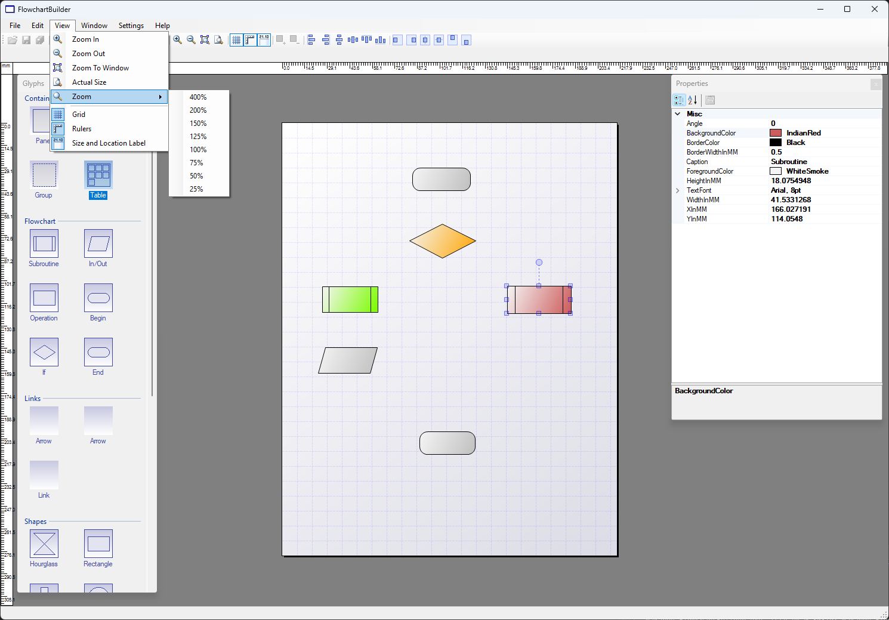

# Flowchart Builder

A simple desktop application for creating and editing flowcharts.

## About

This is a pet project started around 2010 and, realistically, it will probably never be fully finished.

It was built as an experiment in custom UI, rendering, and diagram editing — long before modern frameworks and libraries made this kind of work easier.

## Features

- Grid-based canvas  
- Basic flowchart elements (Begin/End, Operation, Decision, etc.)  
- Element selection, movement, resizing  
- Zoom support  
- Property panel (position, size, colors, text)  
- Simple connectors  

## Tech

- C#  
- WinForms  
- GDI+ (custom rendering)  

## Purpose

Mainly a playground for:

- building UI tools from scratch  
- handling mouse interaction and layout  
- experimenting with diagram editors  

## Status

Incomplete and not actively developed.  
Left here as-is.

## Screenshot

## Run

Open the solution in Visual Studio and run.
